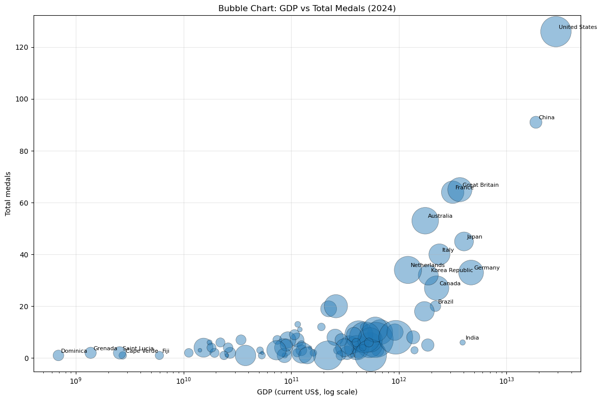
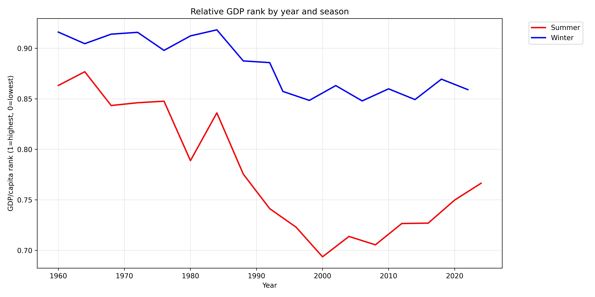

# Milestone 1 Report

<!--- **10% of the final grade**

This is a preliminary milestone to let you set up goals for your final project and assess the feasibility of your ideas.
Please, fill the following sections about your project.

*(max. 2000 characters per section)* --->

### Dataset

<!---  > Find a dataset (or multiple) that you will explore. Assess the quality of the data it contains and how much preprocessing / data-cleaning it will require before tackling visualization. We recommend using a standard dataset as this course is not about scraping nor data processing.
>
> Hint: some good pointers for finding quality publicly available datasets ([Google dataset search](https://datasetsearch.research.google.com/), [Kaggle](https://www.kaggle.com/datasets), [OpenSwissData](https://opendata.swiss/en/), [SNAP](https://snap.stanford.edu/data/) and [FiveThirtyEight](https://data.fivethirtyeight.com/)).  --->

We explore three datasets: (1) Olympic medals by country and year [1], (2) Gross Domestic Product (GDP) by country and year [2], and (3) GDP per capita by country and year [3]. The GDP and GDP per capita datasets come from the same source and have the same structure. The only difference is that one reports total GDP, while the other reports GDP divided by population.

The Olympics data is high quality and requires limited preprocessing. It spans 1896 to 2024, has no missing values, and provides consistent information on year, country, sport, medal, and event. However, the country codes are in the IOC format, used by the International Olympic Committee.

The GDP data [2] requires slightly more preprocessing. It spans 1960 to 2025 and contains missing GDP values for some country-year observations. It also includes aggregate regional entries and uses a different country coding convention (World Bank and ISO3). Missing values mainly come from country series that start later in the time range. A smaller number of countries have no GDP data at all, show gaps in the middle of the series, or have missing values at both the start and the end.

To align the Olympics data with the GDP data, we restrict the analysis to 1960 onward and map IOC country codes to World Bank and ISO3 three-letter country codes. We then merge the GDP data by country code and year, so each Olympic medal entry is matched with the GDP value of that country in the same year. Some missing values remain for historical countries and special Olympic teams that do not have direct GDP data.

### Problematic

<!---  > Frame the general topic of your visualization and the main axis that you want to develop.
> - What am I trying to show with my visualization?
> - Think of an overview for the project, your motivation, and the target audience.  --->

We are interested in exploring the relationship between a country's economic performance (as measured by GDP) and its success in the Olympic Games (as measured by the number of medals won). Our motivation is to understand whether there is a correlation between a country's wealth and its sports achievements. The target audience for our visualization includes sports enthusiasts, economists, and policymakers who are interested in the intersection of sports and economics.

We take a critical stance on the meritocratic narrative often associated with Olympic success, which tends to focus on absolute achievements without considering the resources available to different countries. By analyzing the efficiency of medal wins in relation to GDP, we aim to provide a more nuanced perspective on Olympic success that accounts for economic disparities among nations.

We will explore the temporal evolution of this relationship, as well as the differences across various sports, to identify patterns and insights that may not be immediately apparent from raw medal counts alone. 

Throughout our analysis, we use both GDP per capita and absolute GDP. This helps us compare whether Olympic success is more closely associated with resources available per person or with the total economic size of a country. Larger economies may be able to allocate more resources to sports systems and Olympic programs, while higher GDP per capita may reflect broader access to infrastructure, training, and support at the individual level.

### Exploratory Data Analysis

<!---  > Pre-processing of the data set you chose
> - Show some basic statistics and get insights about the data
 --->

The table below summarizes the merged dataset:

| Variable | Value |
|---|---|
| Number of entries/medals | 16,333 |
| Number of sports | 80 |
| Number of countries | 166 |
| Number of Summer Olympics Events | 17 |
| Number of Winter Olympics Events | 17 |
| Missing data (GDP) | 9.81% |

The first plot shows total medals against GDP by country in the latest available year and suggests a positive relationship between economic size and medal counts. Countries with the largest economies tend to appear toward the upper-right of the figure, while many lower-GDP countries cluster near very low medal totals. This is broadly consistent with the idea that larger economies often win more medals overall.

At the same time, the pattern is not exact. Some countries with very large GDPs win fewer medals than their economic size alone might suggest, while some smaller economies achieve comparatively high medal totals. As the size of the bubbles represents the GDP per capita, that large economies such as China have a high medal count despite low GDP per capita, while smaller but wealthier countries have a low medal count relative to their GDP per capita.

The second plot shows the mean GDP rank of medal winners over years, separated by the season. To make years comparable, we normalize the GDP values as relative ranks of countries within each year. The plot confirms that the average medal winner always came from a top 30% GDP/capita country, with a much stronger relationship for winter sports. The relationships seems to have significantly weakened in the 90's with recent years in the summer olympics showing a slight increase in the average GDP rank of medal winners.

The ten individual sports with the highest mean GDP rank of medal winners include expensive sports such as ice hockey, alpine skiing and equestrian:

| Sport               | Avg. GDP/Capita Rank   |
|:--------------------|:-----------|
| Ice Hockey          | 91.9%      |
| Alpine Skiing       | 91.5%      |
| Curling             | 91.4%      |
| Nordic Combined     | 91.3%      |
| Equestrian Dressage | 91.0%      |
| Equestrian          | 91.0%      |
| Bobsleigh           | 90.9%      |
| Softball            | 90.8%      |
| Speed skating       | 90.3%      |
| Snowboard           | 90.3%      |

The lower end includes cheap racquet sports, gymnastics and martial arts:
| Sport               | Avg. GDP/Capita Rank   |
|:--------------------|:-----------|
| Hockey              | 67.3%      |
| Karate              | 66.6%      |
| Taekwondo           | 66.5%      |
| Gymnastics Rhythmic | 66.0%      |
| Trampoline          | 64.7%      |
| Weightlifting       | 64.7%      |
| Wrestling           | 62.4%      |
| Table Tennis        | 57.5%      |
| Badminton           | 56.5%      |
| Artistic swimming   | 54.0%      |

### Related work

<!---  
> - What others have already done with the data?
> - Why is your approach original?
> - What source of inspiration do you take? Visualizations that you found on other websites or magazines (might be unrelated to your data).--->

Works in economics found a positive relationship between GDP and Olympic success [3]. Such mathematical models come with at several limitations: They have scarce visualizations of the relationships. They also do not distinguish between individual sports that may be more resource-intensive compared to others. Lastly, they omit the temporal evolution which is relevant since hits on the economy may become visible years later as Olympic success is often the result of long-term investments in sports infrastructure and training programs.

Previous course projects [2] have explored the temporal evolution of Olympic medals focussing on countries, sports and genders. The economic development of countries and its relationship with Olympic success has been less explored. Instead of only praising success in terms of absolute success, we want to explore efficiency in terms of medals won as a function of GDP, explore temporal trends of this relationship and check sports-specific patterns.

For engaging visualizations, we take inspirations from interactive maps with observer interactions [3,4] and bar chart races [5], where we plan to add a new dimension to include efficiency of medal wins.

[1] Ashyou09. (2024). [Olympics Athletes Dataset (1896–2024)](https://www.kaggle.com/datasets/ashyou09/olympics-athletes-dataset-18962024) [Data set]. Kaggle.

[2] World Bank. (2024). [GDP (current US$)](https://data.worldbank.org/indicator/NY.GDP.MKTP.CD) [Data set]. World Development Indicators.

[3] World Bank. (2024). [GDP per capita (current US$)](https://data.worldbank.org/indicator/NY.GDP.PCAP.CD) [Data set]. World Development Indicators.

[3] Bernard, A. B., & Busse, M. R. (2004). [Who wins the Olympic Games: Economic resources and medal totals](https://watermark02.silverchair.com/003465304774201824.pdf). Review of economics and statistics, 86(1), 413-417.

[4] [CS-480 Project: Medalytics](https://github.com/com-480-data-visualization/Medalytics)

[5] [EU Regions Funding](https://pudding.cool/2019/04/eu-regions/)

[6] [Visual Introduction to Machine Learning](https://r2d3.us/visual-intro-to-machine-learning-part-1/)

[7] [Bar Chart Race](https://flourish.studio/visualisations/bar-chart-race/)
