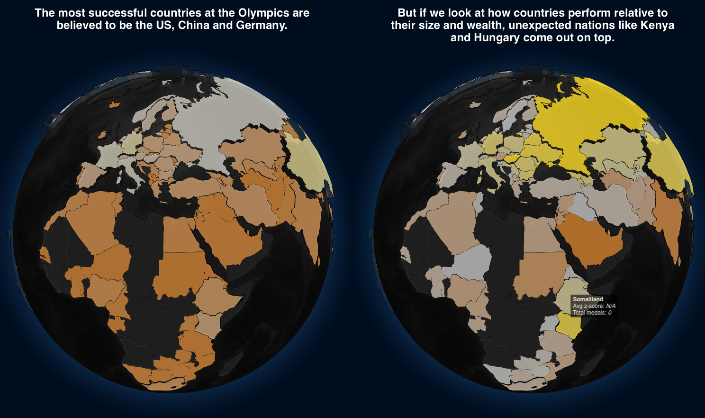
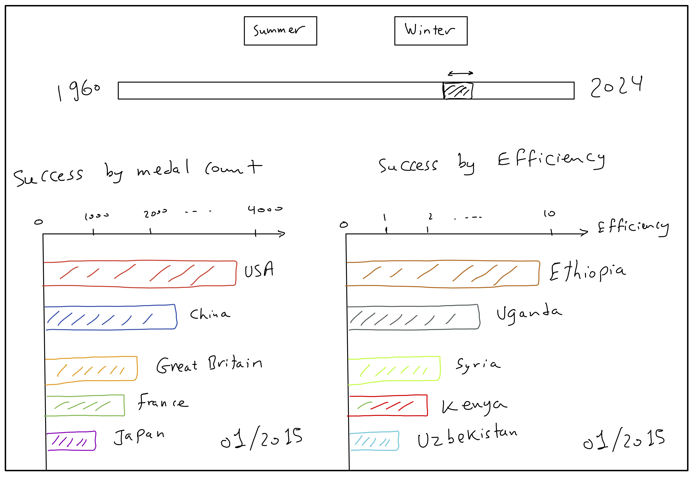

# Milestone 2 Report

<!-- Friday 1st May, 5pm 
10% of the final grade
Two A4 pages describing the project goal.
• Include sketches of the vizualiation you want to make in your final product.
• List the tools that you will use for each visualization and which (past or future)
lectures you will need.
• Break down your goal into independent pieces to implement. Try to design a
core visualization (minimal viable product) that will be required at the end.
Then list extra ideas (more creative or challenging) that will enhance the
visualization but could be dropped without endangering the meaning of the
project.
Functional project prototype review.
• You should have an initial website running with the basic skeleton of the
visualization/widgets. -->

## Project Goal

We want to explore the relationship between economic indicators and Olympic success. The goal is to diverge from the traditional medal count and instead focus on how various economic factors, such as GDP and population size, correlate with a country's performance in the Olympics. We want to praise the overachievers and understand the underachievers, rather than just celebrating the countries with the most medals.

Our visualization begins with a globe that shows the traditional medal count. However, on scrolling, we transition to a more insightful visualization that highlights the countries that perform exceptionally well relative to their size and wealth. This will allow us to uncover hidden gems in the Olympic landscape and provide a more nuanced understanding of success in the games.

*Figure 1: Screenshot of the current Globes implementation.*

For this visualization, we will draw on insights from the Lectures on Maps. As a technology we use the [Globe library](https://github.com/vasturiano/globe.gl) that is based on WebGL for performant rendering.

The second visualization focuses on our methodology.

The third visualization shows how the modern state of medal and efficiency came to be, and how it evolved over time.

## Components
### Globes

### Bubble Chart

### Racing Bar Charts 
This visualization compares two ways of telling the Olympic success story: which countries win the most medals over time, and which countries improve most efficiently relative to their GDP per capita. The contrast is important because a country with a modest economy but a growing medal count may be more remarkable than a wealthy country that wins many medals but performs close to expectation.

The current prototype implements this idea through two synchronized racing bar charts, shown in Figure 2. The medal-count race starts as the main view and ranks countries across Olympic periods from 1960 onward. As the user scrolls, it shifts left and an efficiency race appears on the right. This reveals the same timeline first through absolute medal success, then through resource-adjusted performance. The charts animate automatically, and a button above the charts lets users switch between Summer and Winter Olympics.

**Core implementation.** The next version would consist of the existing working prototype plus two refinements: adding country flags to make the rankings easier to scan, and tuning the animation speed so frame transitions are readable and aligned between the medal-count and efficiency charts.

**Possible extensions.**  A more exploratory extension would connect efficient countries to the sports in which they gain medals, for example through a small linked panel showing the top contributing sports for the selected country. This would help explain how efficient countries improve without overloading the racing bar chart itself.

**Tools and lectures.** We utilise the [Race Bars Library](https://github.com/hatemhosny/racing-bars), which provides animated racing bar charts. The Interactions lecture will guide the scroll-triggered transitions and playback behavior, the Storytelling lecture will guide the narrative sequence, and the Perception and Colors lecture will guide the visual encoding of medals and efficiency.

*Figure 2: Sketch of the current racing bar chart implementation.*

## Initial Website Prototype

Our initial prototype is available at [https://com-480-data-visualization.github.io/GSP/](https://com-480-data-visualization.github.io/GSP/).
