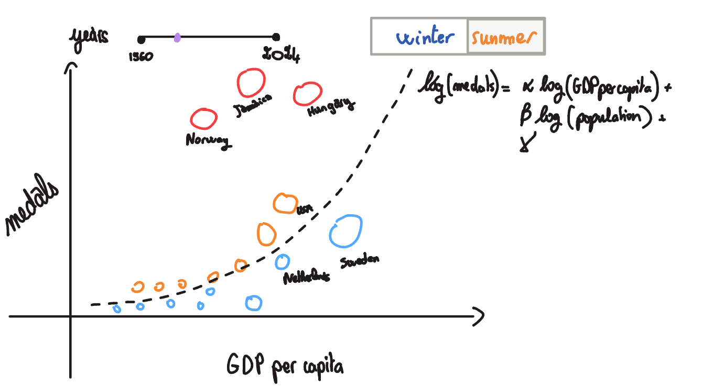

# Milestone 2 Report

<!-- Friday 1st May, 5pm 
10% of the final grade
Two A4 pages describing the project goal.
• Include sketches of the vizualiation you want to make in your final product.
• List the tools that you will use for each visualization and which (past or future)
lectures you will need.
• Break down your goal into independent pieces to implement. Try to design a
core visualization (minimal viable product) that will be required at the end.
Then list extra ideas (more creative or challenging) that will enhance the
visualization but could be dropped without endangering the meaning of the
project.
Functional project prototype review.
• You should have an initial website running with the basic skeleton of the
visualization/widgets. -->

## Project Goal

The goal of the project is to explore the relationship between economic indicators and Olympic success. The goal is to diverge from the traditional medal count and instead focus on how various economic factors, such as GDP and population size, correlate with a country's performance in the Olympics. We want to praise the overachievers and understand the underachievers, rather than just celebrating the countries with the most medals.

## Overview of Visualizations

As an introduction and appetizer, the first visualization shows total medal counts compared to exceeding expected performance based on economic indicators. It serves as a teaser to highlight the contrast between traditional medal counts and our more nuanced approach, setting the stage for the deeper exploration that follows.

The second visualization focuses on our methodology. It serves to explain how we calculate expected performance based on economic indicators and how we identify overachievers and underachievers.

The third visualization shows how the modern state of medal and efficiency came to be, and how it evolved over time. It adds the temporal dimension to the story, showing how countries have improved or declined in both absolute medal counts and efficiency over the decades. This allows us to see trends and patterns that may not be apparent in a static view.

A potentially fourth visualization focuses on the sports that contribute most to efficient countries, to help explain how they achieve their success. This would be an optional extension that adds depth to the story without being essential to the core narrative.

## Components

### Globes

Our data story begins with a globe that shows the traditional medal count. However, on scrolling, we transition to a more insightful visualization that highlights the countries that perform exceptionally well relative to their size and wealth. This will allow us to uncover hidden gems in the Olympic landscape and provide a more nuanced understanding of success in the games.

*Figure 1: Screenshot of the current Globes implementation.*

**Tools and lectures.** For this visualization, we will draw on insights from the Lectures on Maps. As a technology we use the [Globe library](https://github.com/vasturiano/globe.gl) that is based on WebGL for performant rendering.

### Bubble Chart

This visualization exposes the methodology behind our efficiency metric. It plots each country as a bubble on a log-log scatter chart with GDP per capita on the x-axis and medal count on the y-axis, where bubble size encodes population. A dashed regression line captures the expected performance predicted by the model log(medals) = α·log(GDP per capita) + β·log(population) + γ. Countries sitting well above the line are overachievers - they win more medals than their economic and demographic profile would predict - while those below are underachievers. A year slider (1960–2024) lets users animate how countries drift relative to the expectation over time, and a Winter/Summer toggle switches the underlying dataset.

*Figure 2: Sketch of the Bubble Chart implementation.*

**Core implementation.** The next version will render the scatter plot with D3, fit the log-linear regression on the fly for the selected year and season, and colour bubbles by over- or under-performance relative to the regression line. The year slider will animate the chart so that users can watch countries rise above or fall below expectation over Olympic history.

**Possible extensions.** The finished visualization plots countries on a GDP per capita vs. actual/expected medals ratio axis, with bubble size encoding medal count and bubble color encoding a five-tier z-score scale from far above (gold) to far below (blue). Hovering a bubble reveals a tooltip with country flag, GDP, population, actual vs. expected medals, and a z-score label. Clicking a bubble pins it, dims all others, and draws a dashed orange trajectory polyline tracing that country's path through every Olympic year. A side leaderboard shows the top five over- and under-performers for the current year. A play/pause/replay button animates through years at 1.2-second intervals, and a Summer/Winter toggle switches the entire dataset.

**Tools and lectures.** We will use [D3.js](https://d3js.org/) (introduced in the week 4 D3 lecture) for the scatter plot, regression fit, and animations. The Marks and Channels lecture will guide the visual encoding of GDP, medals, and population, the Perception and Colors lecture will guide the diverging colour scale for over- and under-achievement, and the Interactions lecture will inform the slider and toggle behaviour.

### Racing Bar Charts 
This visualization compares two ways of telling the Olympic success story: which countries win the most medals over time, and which countries improve most efficiently relative to their GDP per capita. The contrast is important because a country with a modest economy but a growing medal count may be more remarkable than a wealthy country that wins many medals but performs close to expectation.

The current prototype implements this idea through two synchronized racing bar charts, shown in Figure 2. The medal-count race starts as the main view and ranks countries across Olympic periods from 1960 onward. As the user scrolls, it shifts left and an efficiency race appears on the right. This reveals the same timeline first through absolute medal success, then through resource-adjusted performance. The charts animate automatically, and a button above the charts lets users switch between Summer and Winter Olympics.

**Core implementation.** The next version would consist of the existing working prototype plus two refinements: adding country flags to make the rankings easier to scan, and tuning the animation speed so frame transitions are readable and aligned between the medal-count and efficiency charts.

**Possible extensions.**  A more exploratory extension would connect efficient countries to the sports in which they gain medals, for example through a small linked panel showing the top contributing sports for the selected country. This would help explain how efficient countries improve without overloading the racing bar chart itself.

**Tools and lectures.** We utilise the [Race Bars Library](https://github.com/hatemhosny/racing-bars), which provides animated racing bar charts. The Interactions lecture will guide the scroll-triggered transitions and playback behavior, the Storytelling lecture will guide the narrative sequence, and the Perception and Colors lecture will guide the visual encoding of medals and efficiency.

*Figure 3: Sketch of the current racing bar chart implementation.*

## Initial Website Prototype

Our initial prototype is available at [https://com-480-data-visualization.github.io/GSP/](https://com-480-data-visualization.github.io/GSP/).
