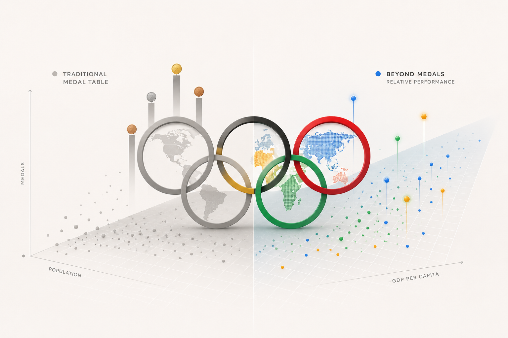

# Project of Data Visualization (COM-480)



| Student's name | SCIPER |
| -------------- | ------ |
| Mohamed Mamouri | 362231 |
| Fares Fawzi | 337530 |
| Dominik Glandorf | 397208 |

## Final Deliverables 📦

- 🌐 [Website](https://com-480-data-visualization.github.io/GSP/)
- 📘 [Process Book](./MS3/ProcessBook_GSP.pdf)
- 🎬 [Screencast](https://drive.google.com/file/d/1p8uxGZdZaCOCJREh2ywhbeHj5lw5qWTF/view)

## Repository Structure 🗂️

```text
.
├── MS1/                         # Milestone 1 report + early analysis
├── MS2/                         # Milestone 2 report + design drafts
├── MS3/                         # Milestone 3 assets (process book, screencast, figures)
├── data/                        # Raw + merged datasets used in analysis/pipeline
├── figures/                     # Static figures used in reports
├── src/                         # Python data-preparation scripts
├── website/                     # React + TypeScript + Vite web app
├── requirements.txt             # Python dependencies
└── README.md
```

### Frontend Source Tree 🌿

```text
website/src/
├── types/
│   └── olympics.ts                  # Shared data interfaces (GapminderData, Season, …)
├── data/
│   ├── countryMaps.ts               # IOC → ISO2 lookup, flag emoji helpers
│   └── buildRaceSeries.ts           # Pure data-transform for the bar chart race
├── theme/
│   └── raceColors.ts                # Story-country accent colors + soft palette
├── hooks/
│   └── useWindowSize.ts             # Reactive window dimensions hook
├── components/
│   ├── sections/
│   │   ├── HeroSection.tsx          # Landing hero
│   │   └── KeyFindings.tsx          # Closing findings grid
│   ├── BarChartRaceSection/
│   │   ├── index.tsx                # Racing-bars dual-chart component
│   │   ├── RaceControls.tsx         # Play / pause / skip / slider / year display
│   │   └── ReferenceLine.tsx        # Dashed "expected" overlay on efficiency chart
│   ├── GlobeSection.tsx             # Dual-globe WebGL view
│   ├── GapminderScatter.tsx         # Animated bubble scatter plot
│   └── OurMethodology.tsx           # Methodology explainer
├── App.tsx                          # Top-level layout and scroll wiring
├── index.css                        # CSS custom properties (colors, typography)
└── main.tsx                         # React entry point
```


## Tech Stack 🛠️

-  React
-  TypeScript
-  Vite
-  Python
-  pandas
-  numpy
-  GitHub Pages (`gh-pages`)

## How To Run 🚀

### Prerequisites ✅

- Git
- Node.js (recommended: v18+)
- npm (recommended: v9+)
- Python (recommended: v3.10+)

### Quick Setup ⚡

```bash
git clone https://github.com/com-480-data-visualization/GSP.git
cd GSP

python -m venv .venv
source .venv/bin/activate
pip install -r requirements.txt

cd website
npm install
npm run dev
```

The website runs locally at `http://localhost:5173/GSP/`.

## Deployment 🚢

We deploy using GitHub Pages from the `website/` folder:

```bash
cd website
npm run deploy
```

This builds the app and publishes `website/dist` via `gh-pages`.

## Data Preparation Instructions 🧪

The project already includes local copies of the required datasets in [`data/`](./data), so the website can run without re-downloading data.

External data sources and acquisition notes are documented in [`MS1/README.md`](./MS1/README.md).

### How We Merged The Data 🔗

1. The core merged inputs are [`data/olympics_gdp_merged.csv`](./data/olympics_gdp_merged.csv) and [`data/olympics_gdp_current_usd_merged.csv`](./data/olympics_gdp_current_usd_merged.csv).
2. In [`src/generate_gapminder.py`](./src/generate_gapminder.py), we merge those two files by `gdp_country_code`, `year`, and `season`, then derive population using `population = gdp_current_usd / gdp_per_capita`.
3. The same script aggregates split-country rows with the same code/year/season (for example historical Germany rows) in `merge_shared_codes`.

### How We Harmonized Country Names/Codes 🌍

- [`src/utils.py`](./src/utils.py): IOC 3-letter to ISO3/World Bank code fixes (`code_fix`) used in preprocessing.
- [`website/src/data/countryMaps.ts`](./website/src/data/countryMaps.ts): frontend mapping for display names and flag rendering.

### Output Used By The Website 📄

- Generated file: [`website/public/data/gapminder_scatter.json`](./website/public/data/gapminder_scatter.json)
- Produced by: [`src/generate_gapminder.py`](./src/generate_gapminder.py)

## Reproduction ♻️

To reproduce the main processed JSON used by the web app:

```bash
python src/generate_gapminder.py
```

This regenerates [`website/public/data/gapminder_scatter.json`](./website/public/data/gapminder_scatter.json) from local CSV inputs in [`data/`](./data).

If you want to fully rebuild from external sources, follow the dataset links and notes in [`MS1/README.md`](./MS1/README.md), then run the same preprocessing command above.

### AI usage

We acknowledge the use of AI for assisting with the implementation of the website and the data processing pipeline. AI tools were used to generate boilerplate code, suggest optimizations, and help with debugging. All AI-generated code was reviewed and tested by the team to ensure correctness and quality.